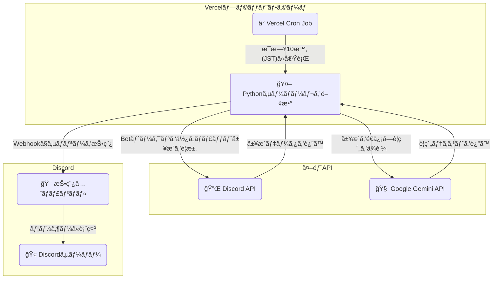

# Discord日次サãƒãƒªãƒ¼Bot 仕様書

**ãƒãƒ¼ã‚¸ãƒ§ãƒ³**: 1.0
**作æˆæ—¥**: 2025å¹´8月12æ—¥

---

## 1. 概è¦

### 1.1. システム目的
本システムã¯ã€æŒ‡å®šã•ã‚ŒãŸDiscordサーãƒãƒ¼å†…ã®å…¨ãƒãƒ£ãƒ³ãƒãƒ«ãŠã‚ˆã³ã‚¹ãƒ¬ãƒƒãƒ‰ã«ãŠã‘ã‚‹éå»24時間ã®æ´»å‹•å†…容をã€Google Gemini APIを利用ã—ã¦è¦ç´„ã—ã€æ¯æ—¥å®šæ™‚ã«æŒ‡å®šãƒãƒ£ãƒ³ãƒãƒ«ã¸æŠ•ç¨¿ã™ã‚‹ã“ã¨ã‚’目的ã¨ã™ã‚‹ã€‚ã“ã‚Œã«ã‚ˆã‚Šã€ãƒ¡ãƒ³ãƒãƒ¼ã¯ã‚µãƒ¼ãƒãƒ¼å†…ã®å…¨ä½“åƒã‚’効ç‡çš„ã«æŠŠæ¡ã§ãる。

### 1.2. 主è¦æ©Ÿèƒ½
-   **定時自動実行**: æ¯æ—¥åˆå‰9~10時（日本時間）ã«ã‚µãƒãƒªãƒ¼ä½œæˆã‚¿ã‚¹ã‚¯ã‚’自動ã§å®Ÿè¡Œã™ã‚‹ã€‚
-   **網羅的ãªãƒ‡ãƒ¼ã‚¿å集**: 権é™ã®ã‚る全テキストãƒãƒ£ãƒ³ãƒãƒ«ãŠã‚ˆã³ã‚¢ã‚¯ãƒ†ã‚£ãƒ–ãªã‚¹ãƒ¬ãƒƒãƒ‰ã®æŠ•ç¨¿ã‚’å集対象ã¨ã™ã‚‹ã€‚
-   **AIã«ã‚ˆã‚‹å†…容è¦ç´„**: å集ã—ãŸãƒãƒ£ãƒƒãƒˆå±¥æ­´ã‚’Google Gemini APIã«é€ä¿¡ã—ã€æŒ‡å®šã•ã‚ŒãŸãƒ•ã‚©ãƒ¼ãƒãƒƒãƒˆã«åŸºã¥ã„ãŸé«˜å“質ãªè¦ç´„を生æˆã™ã‚‹ã€‚
-   **Discordã¸ã®è‡ªå‹•æŠ•ç¨¿**: 生æˆã•ã‚ŒãŸã‚µãƒãƒªãƒ¼ã‚’ã€æŒ‡å®šã•ã‚ŒãŸDiscordãƒãƒ£ãƒ³ãƒãƒ«ã«è‡ªå‹•ã§æŠ•ç¨¿ã™ã‚‹ã€‚

---

## 2. 機能仕様

### 2.1. 定期実行機能
-   **トリガー**: Vercel Cron Job
-   **スケジュール**: `0 0 * * *` (UTC)。日本時間ã®æ¯æ—¥åˆå‰9~10時ã«è¨­å®šã€‚
-   **アクション**: `/api/daily_summary`ã®ãƒ‘スã«ãƒªã‚¯ã‚¨ã‚¹ãƒˆã‚’é€ä¿¡ã—ã€Pythonサーãƒãƒ¼ãƒ¬ã‚¹é–¢æ•°ã‚’èµ·å‹•ã™ã‚‹ã€‚

### 2.2. データå集機能
-   **å集対象**: 指定ã•ã‚ŒãŸã‚µãƒ¼ãƒãƒ¼ï¼ˆGuild）内ã®ã€BotãŒ`メッセージ履歴を読む`権é™ã‚’æŒã¤å…¨ã¦ã®ãƒ†ã‚­ã‚¹ãƒˆãƒãƒ£ãƒ³ãƒãƒ«ãŠã‚ˆã³ãã®ä¸­ã®ã‚¢ã‚¯ãƒ†ã‚£ãƒ–ãªã‚¹ãƒ¬ãƒƒãƒ‰ã€‚
-   **å集期間**: 実行時ã‹ã‚‰é¡ã£ã¦éå»24時間。
-   **å集データ**: ãƒãƒ£ãƒ³ãƒãƒ«åã€ã‚¹ãƒ¬ãƒƒãƒ‰åã€æŠ•ç¨¿è€…å（サーãƒãƒ¼ã§ã®è¡¨ç¤ºå）ã€æŠ•ç¨¿æ™‚刻ã€ãƒ¡ãƒƒã‚»ãƒ¼ã‚¸æœ¬æ–‡ã€‚
-   **除外対象**: Botã«ã‚ˆã‚‹æŠ•ç¨¿ã€ãƒ¡ãƒƒã‚»ãƒ¼ã‚¸æœ¬æ–‡ãŒç©ºã®æŠ•ç¨¿ã€‚

### 2.3. è¦ç´„生æˆæ©Ÿèƒ½
-   **使用サービス**: Google Gemini API
-   **使用モデル**: `gemini-1.5-pro-latest`
-   **プロンプト**: å集ã—ãŸå…¨ãƒãƒ£ãƒƒãƒˆå±¥æ­´ã‚’付ä¸ã—ã€ä»¥ä¸‹ã®è¦ä»¶ã«åŸºã¥ãè¦ç´„を指示ã™ã‚‹ã€‚
    -   å…¨ãƒãƒ£ãƒ³ãƒãƒ«ãƒ»ã‚¹ãƒ¬ãƒƒãƒ‰ã‚’網羅ã™ã‚‹ã“ã¨ã€‚
    -   投稿ãŒãªã‹ã£ãŸãƒãƒ£ãƒ³ãƒãƒ«ã¯ã€ŒæŠ•ç¨¿ãªã—ã€ã¨æ˜è¨˜ã™ã‚‹ã“ã¨ã€‚
    -   時刻ã€æŠ•ç¨¿è€…ã€ä¸»æ—¨ã‚’ç°¡æ½”ã«ã¾ã¨ã‚ã‚‹ã“ã¨ã€‚
    -   指定ã•ã‚ŒãŸå‡ºåŠ›ãƒ•ã‚©ãƒ¼ãƒãƒƒãƒˆä¾‹ã«å¾“ã†ã“ã¨ã€‚

### 2.4. 投稿機能
-   **投稿方å¼**: Discord Webhook
-   **投稿先**: 環境変数ã§æŒ‡å®šã•ã‚ŒãŸå˜ä¸€ã®ãƒãƒ£ãƒ³ãƒãƒ«ã€‚
-   **投稿フォーãƒãƒƒãƒˆ**:
    1.  Pythonå´ã§ç¾åœ¨ã®æ—¥ä»˜ã¨æ›œæ—¥ã‚’å«ã‚€å›ºå®šã‚¿ã‚¤ãƒˆãƒ«ã‚’生æˆã€‚
        -   `ğŸ—“ï¸ YYYYå¹´MM月DD日（曜）投稿サãƒãƒªãƒ¼ï¼ˆå…¨ãƒãƒ£ãƒ³ãƒãƒ«ç¢ºèªæ¸ˆï¼‰`
    2.  Gemini APIã‹ã‚‰è¿”å´ã•ã‚ŒãŸè¦ç´„本文を上記タイトルã®ä¸‹ã«çµåˆã™ã‚‹ã€‚
    3.  Discordã®æ–‡å­—数制é™ï¼ˆ2000文字）を超ãˆã‚‹å ´åˆã¯ã€è‡ªå‹•ã§åˆ†å‰²ã—ã¦é€£ç¶šæŠ•ç¨¿ã™ã‚‹ã€‚

---

## 3. é機能è¦ä»¶

### 3.1. 実行環境
-   **プラットフォーム**: Vercel

### 3.2. 使用言èªãƒ»ãƒ©ã‚¤ãƒ–ラリ
-   **言èª**: Python
-   **主è¦ãƒ©ã‚¤ãƒ–ラリ**:
    -   `discord.py`: ãƒãƒ£ãƒƒãƒˆå±¥æ­´ã®èª­ã¿å–り用
    -   `google-generativeai`: Gemini APIã¨ã®é€£æºç”¨
    -   `requests`: Discord Webhookã¸ã®æŠ•ç¨¿ç”¨

### 3.3. 外部サービス連æº
-   Discord API (Bot Token経由)
-   Google Gemini API (API Key経由)
-   Discord Webhook (Webhook URL経由)

### 3.4. 環境変数
Vercelã®ãƒ—ロジェクト設定ã§ã€ä»¥ä¸‹ã®ç’°å¢ƒå¤‰æ•°ã‚’設定ã™ã‚‹å¿…è¦ãŒã‚る。
-   `DISCORD_BOT_TOKEN`: Discordã‹ã‚‰ãƒãƒ£ãƒƒãƒˆå±¥æ­´ã‚’å–å¾—ã™ã‚‹ãŸã‚ã®Botトークン。
-   `GEMINI_API_KEY`: Google Gemini APIを利用ã™ã‚‹ãŸã‚ã®APIキー。
-   `DISCORD_WEBHOOK_URL`: サãƒãƒªãƒ¼ã‚’投稿ã™ã‚‹å…ˆã®ãƒãƒ£ãƒ³ãƒãƒ«ã®Webhook URL。

## 4. プロジェクトファイル構æˆ
```
.
├── api/
│   └── daily_summary.py   # メインã®Pythonコード
├── requirements.txt         # ä¾å­˜ãƒ©ã‚¤ãƒ–ラリ一覧
└── vercel.json              # Vercel Cron Job設定ファイル
```

## 5. システムアーキテクãƒãƒ£

```mermaid
graph TD
    subgraph "Vercelプラットフォーム"
        Cron(â° Vercel Cron Job)
        ServerlessFunc[🤖 Pythonサーãƒãƒ¼ãƒ¬ã‚¹é–¢æ•°]
    end

    subgraph "外部API"
        DiscordAPI(🔌 Discord API)
        GeminiAPI(🧠 Google Gemini API)
    end

    subgraph "Discord"
        Server(🢠Discordサーãƒãƒ¼)
        TargetChannel(🯠投稿先ãƒãƒ£ãƒ³ãƒãƒ«)
    end

    %% フロー
    Cron -- "æ¯æ—¥10時 (JST)ã«å®Ÿè¡Œ" --> ServerlessFunc
    ServerlessFunc -- "Botトークンを使ã„ãƒãƒ£ãƒƒãƒˆå±¥æ­´ã‚’è¦æ±‚" --> DiscordAPI
    DiscordAPI -- "履歴データを返ã™" --> ServerlessFunc
    ServerlessFunc -- "履歴をé€ä¿¡ã—è¦ç´„ã‚’ä¾é ¼" --> GeminiAPI
    GeminiAPI -- "è¦ç´„テキストを返ã™" --> ServerlessFunc
    ServerlessFunc -- "Webhookã§ã‚µãƒãƒªãƒ¼ã‚’投稿" --> TargetChannel
    TargetChannel -- "ユーザーã«è¡¨ç¤º" --> Server
```
